# Cyber Physical Systems - (Real-Time Embedded Systems) Report

## Description :

In this project , we designed a system to control entrances to a virtual company. The system contained three major parts :

1) embeded part ( sensors and hardware modules ) : We give every body in the system an RFID Tag , using these tags and sensors we authenticate employers. RFID sensor read the information about employers .
In the design of door , there is a LED light and monitor in front of the door , there we showed the result of authentication using the LED light. (grren light for the authenticated users and red light for unathenticated users) We used Arduino board for controling modules and ESP8266 wifi for handling the network part of the project .
2) cloud : Web server including a list that indicate who is eligable to enter is in this part. 
3) supervisory system : This part is actually a software which can communicate with the web server via web socket .

## Installation :
In our project, we use the Proteus project for simulating the embedded part. Proteus is a simulation software that allows us to model and simulate the behavior of electronic circuits.

For the implementation of the web server and supervisory parts, we use the Qt framework. Qt is a cross-platform application framework that allows us to develop graphical user interfaces and other software components.

Here's a brief guide for installing Proteus and the Qt framework :

### Proteus Simulations
1. Download and install Proteus from the [Labcenter Electronics website](https://www.labcenter.com/).
2. Open Proteus and import the simulation files provided in the project.
3. Set up the simulations as described in the project documentation.

### Web Server and Supervisory Parts
1. Install the Qt framework from the [Qt website](https://www.qt.io/download).
2. Clone or download the project repository from GitHub.
3. Open the Qt project file (`.pro`) in Qt Creator.
4. Configure the project settings and build the project.
5. Run the built executable to start the web server and supervisory parts.

   
## Code Structure and Implementational Details

### Embedded Section:

The high-level schema of the embedded system:


Our embedded system is consisted of following units:
- **Arduino UNO board:** It is programmed to control all other units and signals.
- **ENC28J60-Ethernet Module:** Used for sending ethernet requests and receiving response from the cloud server.
- **DC-Motor:** Starts when the RFID tag is correct, in order to open the door.
- **Green/Red LEDs:** Turns on when the RFID tag is correct (GREEN LED) and when the RFID tag is false (RED LED)
- **Virtual Terminal:** Since Proteus does not support any RFID Reader, we use virtual terminal for giving the RFID tag to the system.  


### Cloud Section:
#### GUI Client
A GUI Client is used for the admin to get a view of the events published and entry accesses granted
#### Key functions 
Certain functions are used to setup event routing between the server and the client which you can see below
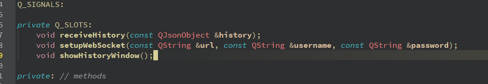
The below class is used for setting up a bidirectional connection between the server and the client , it emits signals which are used to handle the UI Changes in the widget application
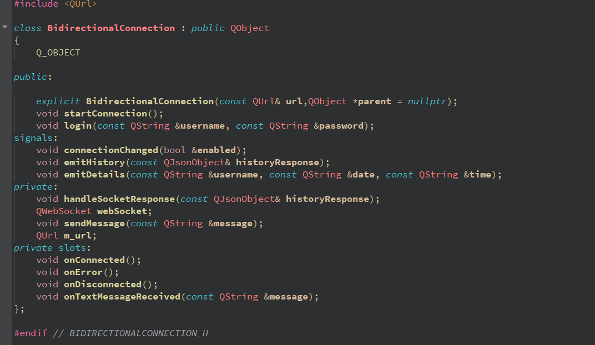 
Finally , connecting signals and slots, and using the already developed code gives us a fully functional application
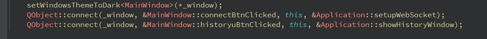
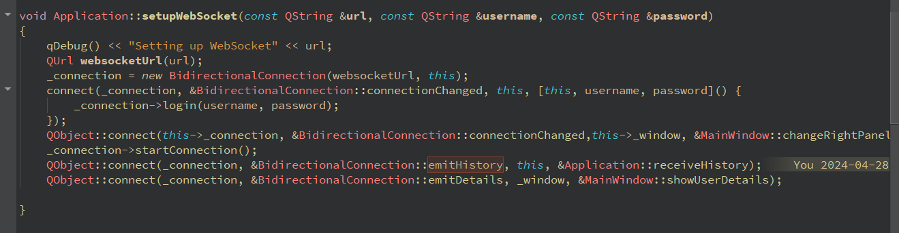
#### RFID Server
This server consists of two main components
1. The websocket server
2. The HTTP Server 
The business / logic layer is all maintained in the top parent class of Server[.cpp]

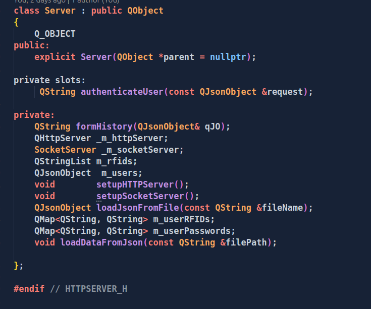

which serves as a container for the web socket server (Used mainly to communicate with)
##### Initialization
Initialization requires a user.json adjacent to RFIDServer.exe when launching, users and their RFIDs-passwords are read from this file
a ```loadJsonFromFile ``` method is used for instantiation of user data

##### Logic 
###### Authentication and Websocket functionalities 
A handle websocket request method has been implemented which is extendible, this helps to add new functionalities on the fly without handling multiple unrelated usecases in the same function 
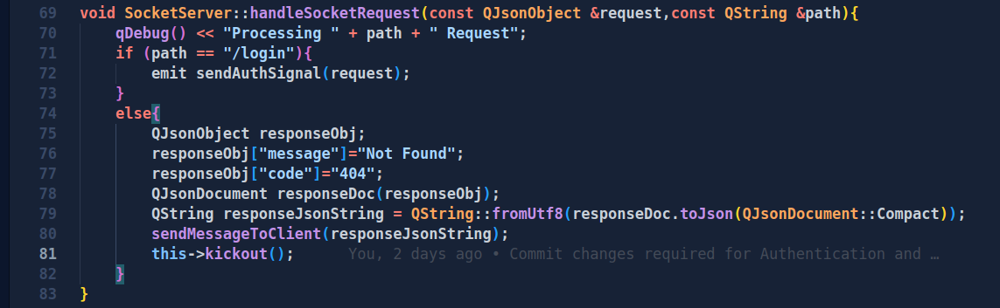
Websocket server only supports one GUI client and discards the old connection upon a new request.
For authentication of users, any incorrect username password combinations will be met with a disconnection and a failed authentication response, enforcing the GUI Client to connect again
When websocket receives a new request, it emits a signal to the server class ( We avoided sharing logical resources by using signals here), server handles and uses the web socket attribute field to send the response over to the user 
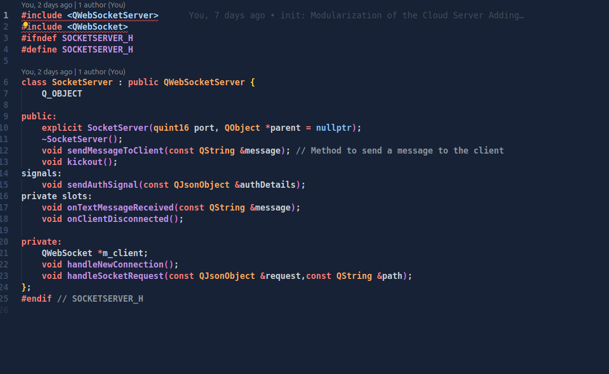
###### RFID checks 
The server exposes a REST endpoint for checking RFIDs against the database for the arduino board access, 
this endpoint URL : 
``` /checkRFID ```
whose implementation is showed below 
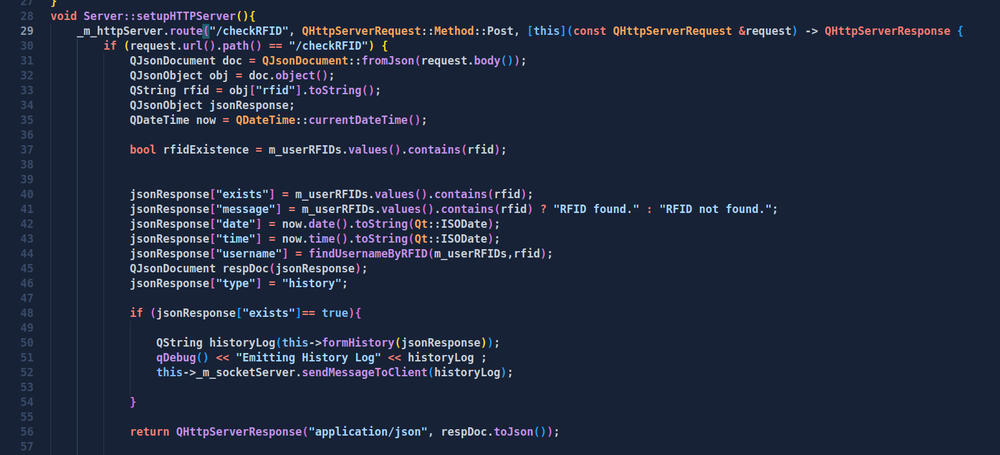
On successful RFID verifications,a history log is sent over to the active GUI connection, this ensures all live details are sent over the connection so the GUI has the latest updates in realtime, 
Also when a new client is connected, history logs related to the past gate openings which are stored on a file in the disk, are sent serially over the network to the user 
Code from history implementation which iterates over the internal historyArray list to send arrays
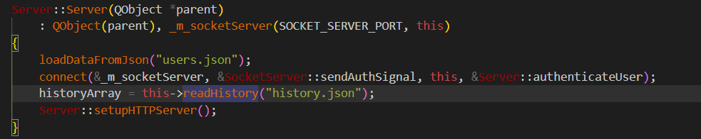
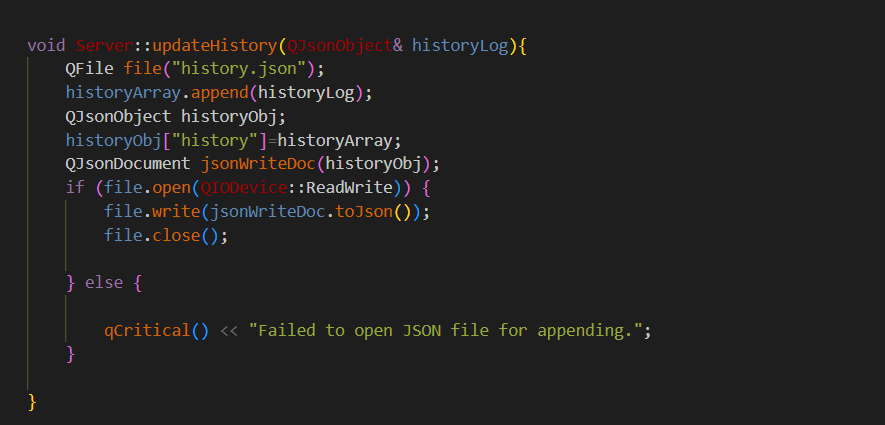
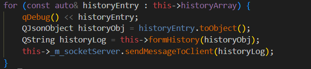
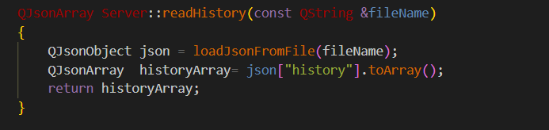
##### User Details 
The last passing user on the gate will appear on the gate, the user details is in the form of a history log and is emitted as shown in the code below 
implemented using the ```formUserDetails()``` function

# Output
## Embedded System:
### True RFID on the Embedded System
The DC-Motor starts by rotating clockwisely to open the door, and the Green LED light turns on. After a predefined amount of time, the DC-Motor starts rotating counter clockwisely and the Green LED light turns off.   

     
     
  
### False RFID on the Embedded System
The Red LED turns on and the door is not opening.      

       


      
## Cloud Server:
The output of the client server is shown below
### User Details
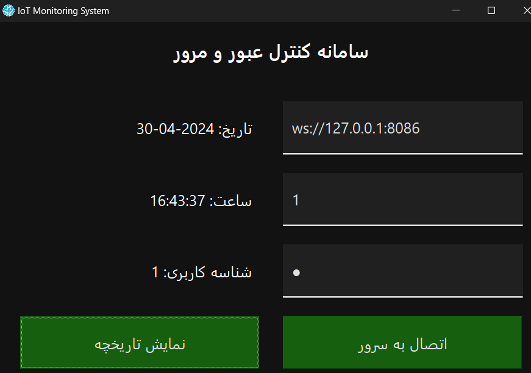
### History output
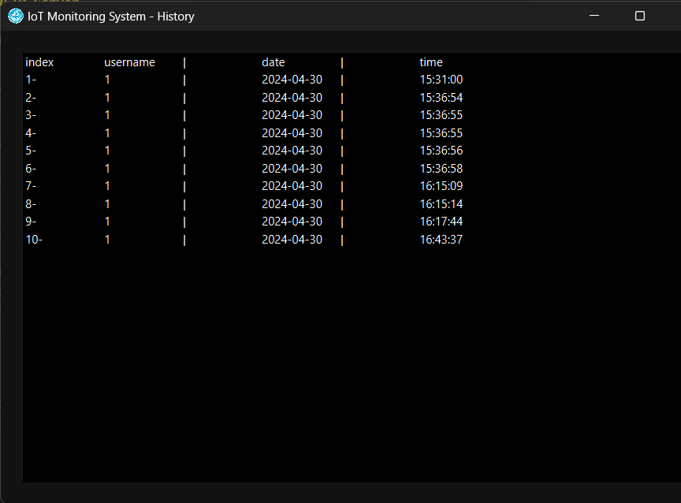
### Right Panel disabled
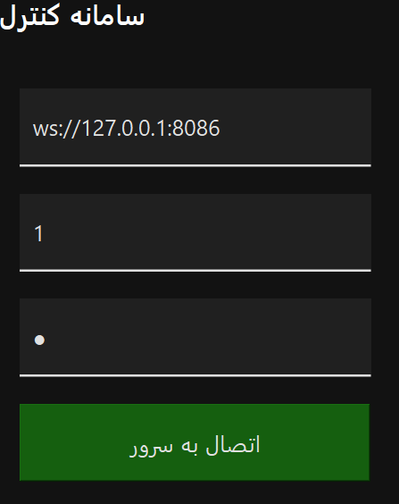
## Postman results
### Not Found 
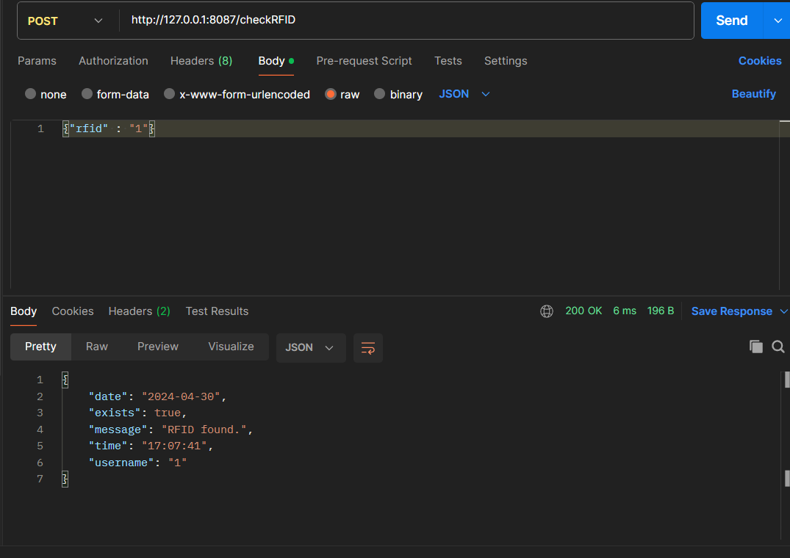
### Found
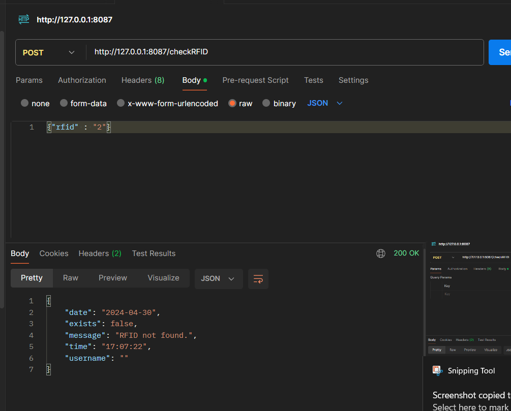
